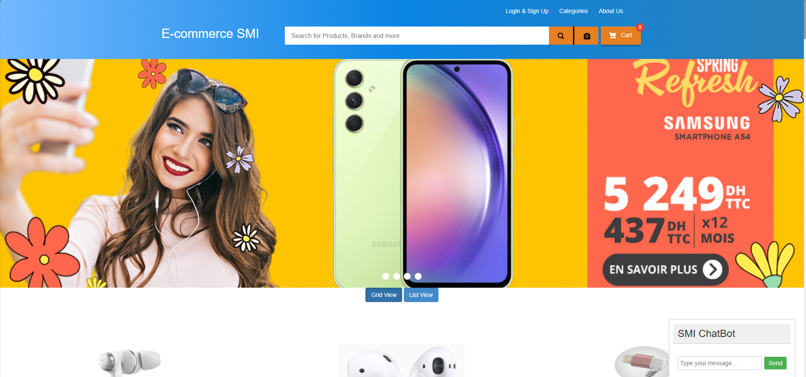
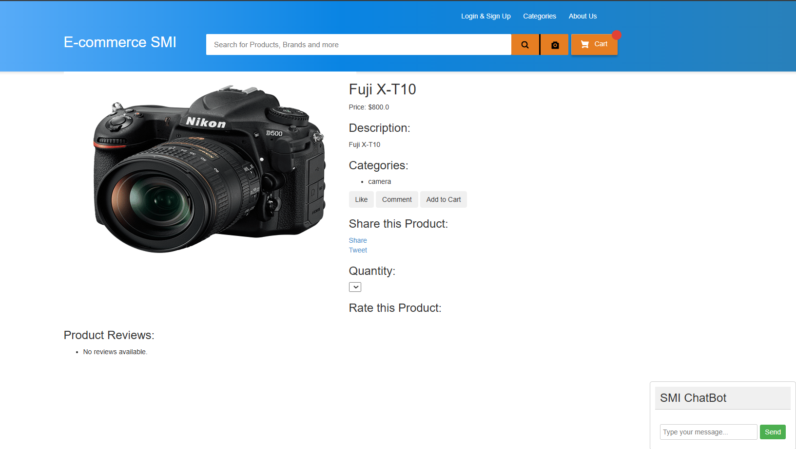
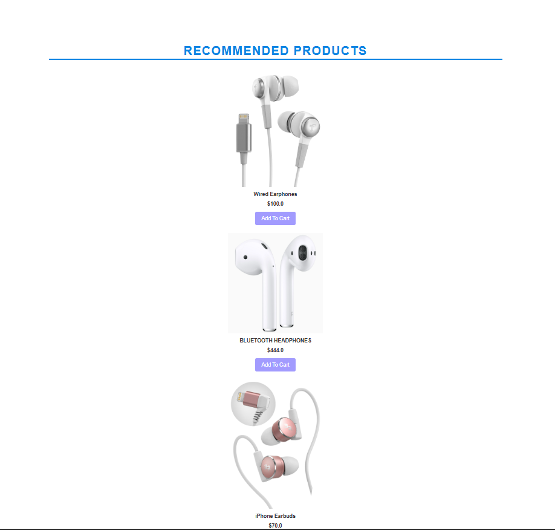

# E-Commerce Web Application

This project is a comprehensive e-commerce web application built with Django, offering various functionalities such as product recommendations, image recognition, and chatbot integration. The application allows users to browse products, receive personalized recommendations, and interact with an intelligent chatbot for assistance.

## Table of Contents
- [Features](#features)
- [Technologies Used](#technologies-used)
- [Setup and Installation](#setup-and-installation)
- [Project Structure](#project-structure)
- [Usage](#usage)
- [Functionality Details](#functionality-details)
  - [Image Recognition](#image-recognition)
  - [Recommendation System](#recommendation-system)
  - [Chatbot Integration](#chatbot-integration)
- [Screenshots](#screenshots)
- [Contributing](#contributing)
- [License](#license)
- [Contact](#contact)

## Features
- **User Authentication:** Register, login, and manage user accounts.
- **Product Management:** Browse, search, and filter products.
- **Image Recognition:** Classify images to suggest related products.
- **Recommendation System:** Personalized product recommendations based on user activity.
- **Chatbot Integration:** Interactive chatbot for customer support and product inquiries.

## Live Demo
Check out the live version of the project here: [Visit the Website](https://fpn-smi.all-as.tech/)

## Technologies Used
- **Backend:** Django, Django REST Framework
- **Frontend:** HTML, CSS, JavaScript
- **Database:** SQLite (or any other Django-supported database)
- **Machine Learning:** TensorFlow, MobileNetV2 for image recognition
- **Other Libraries:** Pandas, Scikit-Learn for recommendation logic

## Setup and Installation
Follow these instructions to set up and run the project locally.

### Prerequisites
- Python 3.6+
- Django 3.0+
- Virtualenv (recommended)

### Installation

1. **Clone the Repository:**
    ```bash
    git clone https://github.com/useAllasS/portofolio-webstack.git
    cd portofolio-webstack
    ```

2. **Create a Virtual Environment:**
    ```bash
    python -m venv env
    ```

3. **Activate the Virtual Environment:**
    - **Windows:**
      ```bash
      env\Scripts\activate
      ```
    - **Linux/MacOS:**
      ```bash
      source env/bin/activate
      ```

4. **Install Dependencies:**
    ```bash
    pip install -r requirements.txt
    ```

5. **Apply Migrations:**
    ```bash
    python manage.py migrate
    ```

6. **Create a Superuser:**
    ```bash
    python manage.py createsuperuser
    ```

7. **Run the Server:**
    ```bash
    python manage.py runserver
    ```

8. **Access the Application:**
   Open your web browser and go to `http://127.0.0.1:8000/`.

## Project Structure
.........................


## Usage
- **Image Recognition:** Upload an image to get product suggestions based on the image category.
- **Recommendations:** Log in to receive personalized product recommendations.
- **Chatbot:** Use the chatbot for quick assistance and product queries.

## Functionality Details

### Image Recognition
- The application uses the `MobileNetV2` model to classify images uploaded by users.
- Based on the classification, it suggests products from the same category.
- **Relevant Code:**
    ```python
    def classifierMobileNet(img_path):
        model = MobileNetV2(weights='imagenet')
        img = image.load_img(img_path, target_size=(224, 224))
        img = image.img_to_array(img)
        img = preprocess_input(img)
        img = tf.expand_dims(img, axis=0)
        predictions = model.predict(img)
        predicted_labels = tf.keras.applications.imagenet_utils.decode_predictions(predictions, top=1)
        predicted_category = predicted_labels[0][0][1]
        return predicted_category
    ```

### Recommendation System
- Recommends products based on the user's purchase history using collaborative filtering.
- Utilizes cosine similarity to find similar users and recommend products they have bought.
- **Relevant Code:**
    ```python
    customer_item_matrix = orders_df.pivot_table(
        index='customer_id',
        columns='product_id',
        values='quantity',
        aggfunc='sum'
    )
    customer_item_matrix = customer_item_matrix.fillna(0)
    customer_item_matrix = customer_item_matrix.applymap(lambda x: 1 if x > 0 else 0)
    user_user_sim_matrix = pd.DataFrame(cosine_similarity(customer_item_matrix))
    user_user_sim_matrix.columns = customer_item_matrix.index
    user_user_sim_matrix.index = customer_item_matrix.index
    ```

### Chatbot Integration
- A chatbot integrated into the application assists users with product information and support.
- Uses a predefined set of responses and handles simple queries related to the store.

## Screenshots
**Homepage:**


**Product Category:**


**Recommendations:**


## Contributing
Contributions are welcome! Please fork this repository and submit a pull request.

## License
This project is licensed under the MIT License. See the [LICENSE](LICENSE) file for more details.

## Contact
- **Name:** Youssef
- **Email:** sananonyme@gmail.com
- **LinkedIn:** [My LinkedIn](https://www.linkedin.com/in/youssef-nita-762771205/)
